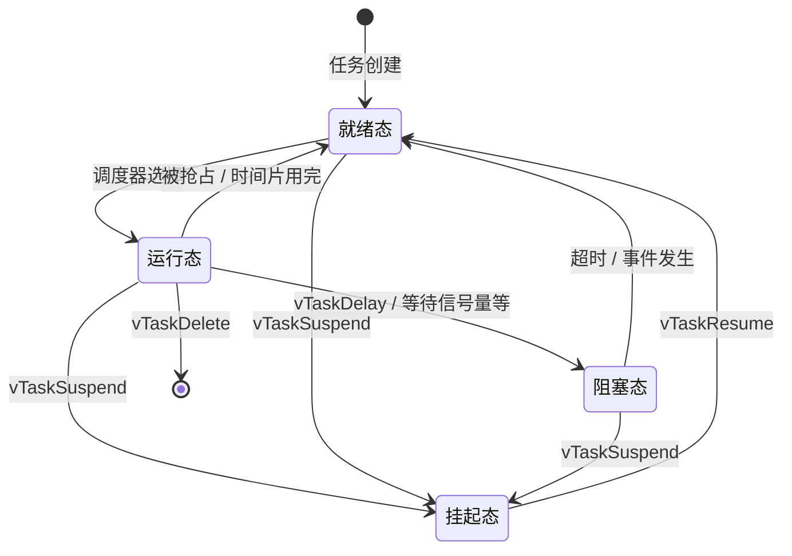

# FreeRTOS 任务调度与挂起/恢复 Q&A

> 基于正点原子 FreeRTOS 课程第5讲：任务挂起和恢复（课堂源码）

---

## Q1: 这个程序怎么就可以确定是在执行任务三的时候，检测到我按了按键 KEY0？整个程序任务是不断切换的啊！

### 答案

关键在于：**只有 task3 调用了 `key_scan()` 函数**。

三个任务的职责对比：

| 任务 | 优先级 | 主要工作 | 延时 |
|------|--------|----------|------|
| task1 | 2 | 打印计数 + 翻转 LED0 | `vTaskDelay(500)` ― 500ms |
| task2 | 3 | 打印计数 + 翻转 LED1 | `vTaskDelay(500)` ― 500ms |
| task3 | 4（最高） | **扫描按键** + 挂起/恢复任务 | `vTaskDelay(10)` ― 10ms |

### 调度过程分析

```
时间轴 →
task3: [扫描按键][延时10ms]...[扫描按键][延时10ms]...[扫描按键]...
task2:             [打印][延时500ms]........................
task1:                    [打印][延时500ms]........................
```

- **task3 优先级最高（4）**，一旦它的 10ms 延时结束，调度器会立刻切回 task3 执行
- task1 和 task2 每次延时 500ms，在这 500ms 期间，task3 可以执行约 **50 次**（500÷10）
- 人按按键的持续时间至少几十毫秒到上百毫秒，task3 每 10ms 就扫描一次，**必然能捕获到按键**

虽然任务在不停切换，但 `key_scan(0)` **只在 task3 中被调用**，不可能在其他任务中检测到按键。

---

## Q2: 怎么算出来 task3 每 10ms 就运行一次？

### 答案

关键在 `FreeRTOSConfig.h` 中的配置：

```c
#define configTICK_RATE_HZ    1000    // 系统时钟节拍频率 1000Hz
```

计算过程：

$$ \text{每个 tick 时长} = \frac{1}{1000} \text{ 秒} = 1 \text{ ms} $$

task3 的代码：

```c
vTaskDelay(10);   // 参数 10 是 tick 数，不是毫秒
```

$$ \text{延时} = 10 \text{ ticks} \times 1 \text{ ms/tick} = 10 \text{ ms} $$

| 配置项 | 值 | 含义 |
|--------|-----|------|
| `configTICK_RATE_HZ` | 1000 | 1 tick = 1ms |
| `vTaskDelay(10)` | 10 ticks | 延时 = 10ms |
| `vTaskDelay(500)` | 500 ticks | 延时 = 500ms |

---

## Q3: task1 和 task2 的 vTaskDelay(500) 不是占用了时间了吗？两个都是 500ms 啊！

### 答案

**`vTaskDelay()` 不会"占用" CPU 时间！**

`vTaskDelay(500)` 的意思是：**把当前任务挂起（进入阻塞态），500 个 tick 之后再唤醒它**。在这 500ms 期间，该任务**完全不占用 CPU**。

### 用时间轴来看

```mermaid
gantt
    title FreeRTOS 任务调度时间轴
    dateFormat X
    axisFormat %L ms
    
    section task3(优先级4)
    扫描按键 延时10ms :t3a, 0, 10
    扫描按键 延时10ms :t3b, 10, 20
    扫描按键 延时10ms :t3c, 20, 30
    扫描按键 延时10ms :t3d, 30, 40
    
    section task2(优先级3)
    打印+翻转LED :t2_run, 0, 1
    阻塞(睡觉) :t2_block, 1, 500
    
    section task1(优先级2)
    打印+翻转LED :t1_run, 1, 2
    阻塞(睡觉) :t1_block, 2, 500
```



### 关键点

| 你以为的 | 实际发生的 |
|----------|-----------|
| `vTaskDelay(500)` 占用 CPU 500ms | `vTaskDelay(500)` 让任务**睡觉** 500ms，CPU 空闲 |
| 三个任务轮流"占用"时间段 | 高优先级任务醒来后**立刻抢占** CPU |

**一句话总结**：`vTaskDelay` 是"主动让出 CPU 去睡觉"，不是"霸占 CPU 死等"。

---

## Q4: vTaskDelay 会让当前任务让出 CPU，task3 会被 CPU 执行，对吗？

### 答案

**完全正确！** 但要补充细节：

### 情况1：task1/task2 调用 `vTaskDelay(500)` 之后

```
task1/task2 → vTaskDelay(500) → 睡觉了 → CPU找就绪任务中优先级最高的
                                              ↓
                                         task3（优先级4）← 最高！
                                              ↓
                                         task3 获得 CPU，执行按键扫描
```

### 情况2：task3 自己的 `vTaskDelay(10)` 到期后

```
task3 睡醒 → 优先级4，比 task1(2) 和 task2(3) 都高
           → 如果 task1/task2 正在跑，task3 会立刻抢占 CPU！
           → 抢占式调度器：高优先级就绪 → 马上抢
```

> 任何时候，只要 task3 处于就绪态，且它是所有就绪任务中优先级最高的，CPU 就归它。

---

## Q5: 所以一旦任务 task3 获得了 CPU 就不可能再让出来了，对吗？

### 答案

**不对！** task3 会主动让出 CPU。

关键就在 task3 自己调用的 `vTaskDelay(10)`：

```c
void task3( void * pvParameters )
{
    while(1)
    {
        key = key_scan(0);           // ← 执行（几微秒）
        if(key == KEY0_PRES) {...}   // ← 执行（几微秒）
        vTaskDelay(10);              // ← 主动睡觉！CPU 让出去！
    }
}
```

### 实际节奏

```
task3: [干活几微秒] → 睡觉10ms → [干活几微秒] → 睡觉10ms → ...
                ↑                              ↑
          主动让出CPU                     主动让出CPU
```

| 说法 | 对/错 |
|------|-------|
| task3 霸占 CPU 不放 | ? 错 |
| task3 每次只占用几微秒，然后主动让出 | ? 对 |
| task3 睡醒后抢占 CPU（因为优先级最高） | ? 对 |
| 其他任务在 task3 睡觉的 10ms 内执行 | ? 对 |

---

## Q6: vTaskDelay() 函数会进入阻塞态，vTaskSuspend() 会进入挂起状态，对吗？

### 答案

**完全正确！**

### FreeRTOS 任务状态对比

| | `vTaskDelay()` | `vTaskSuspend()` |
|---|---|---|
| 状态 | **阻塞态（Blocked）** | **挂起态（Suspended）** |
| 谁来唤醒 | **自动**：延时到期后自动回到就绪态 | **手动**：必须用 `vTaskResume()` 恢复 |
| 有超时吗 | ? 有（指定 tick 数） | ? 没有，可能永远挂起 |
| 操作对象 | 只能是**调用者自己** | 可以是**任何任务**（通过句柄） |

### 为什么挂起后 vTaskDelay 也救不了 task1？

```
task1 被 vTaskSuspend → 挂起态（Suspended）
                         ↓
                   调度器完全忽略它！
                   即使 vTaskDelay(500) 超时了也没用
                   因为它在挂起态，不在阻塞态等待
                         ↓
                   只有 vTaskResume() 能把它拉回就绪态
```

**一句话**：阻塞态是"设了闹钟睡觉"，挂起态是"被打晕了，只能靠别人叫醒"。

---

## FreeRTOS 任务状态转换图



---

> ? 整理时间：2026年6月2日  
> ? 来源：与 GitHub Copilot 对话整理  
> ? 远程仓库：https://github.com/lzy2022cg/FreeRTOS_Study
