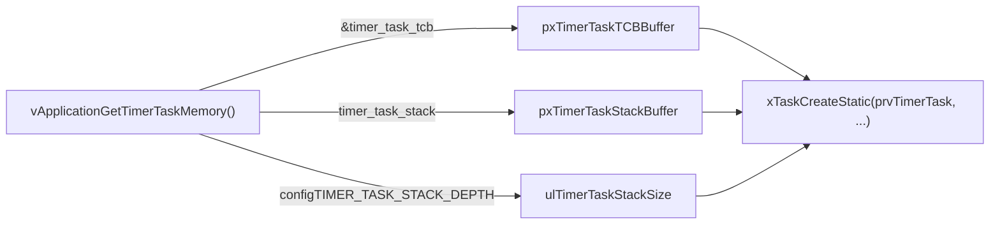

# FreeRTOS 空闲任务与定时器任务创建流程

> 基于正点原子 FreeRTOS 任务创建和删除（静态方式）课堂源码分析

---

## 1. 空闲任务 (Idle Task)

空闲任务是内核**自动创建**的，创建过程分两步：

| 步骤 | 文件 | 位置 | 说明 |
|------|------|------|------|
| **内存分配（用户实现）** | `User/freertos_demo.c` 第 79-85 行 | `vApplicationGetIdleTaskMemory()` | 提供 TCB 和堆栈内存 |
| **实际创建（内核）** | `Middlewares/FreeRTOS/tasks.c` 约第 2011 行 | `vTaskStartScheduler()` 中调用 `xTaskCreateStatic()` | 创建空闲任务 |

用户在 `freertos_demo.c` 中**预先声明**空闲任务的内存：

```c
StaticTask_t idle_task_tcb;                              // 空闲任务TCB
StackType_t  idle_task_stack[configMINIMAL_STACK_SIZE];  // 空闲任务堆栈
```

内核调用 `vApplicationGetIdleTaskMemory()` 拿到这些内存地址后，在 `vTaskStartScheduler()` 里通过 `xTaskCreateStatic()` 创建空闲任务，优先级为最低（0）。

---

## 2. 定时器任务 (Timer Task / Daemon Task)

定时器任务同样是内核**自动创建**的：

| 步骤 | 文件 | 位置 | 说明 |
|------|------|------|------|
| **内存分配（用户实现）** | `User/freertos_demo.c` 第 88-95 行 | `vApplicationGetTimerTaskMemory()` | 提供 TCB 和堆栈内存 |
| **实际创建（内核）** | `Middlewares/FreeRTOS/timers.c` 第 233 行 | `xTimerCreateTimerTask()` 内调用 `xTaskCreateStatic()` | 创建定时器服务任务 |
| **调用入口** | `Middlewares/FreeRTOS/tasks.c` 约第 2044 行 | `vTaskStartScheduler()` 中调用 `xTimerCreateTimerTask()` | 调度器启动时自动调用 |

用户在 `freertos_demo.c` 中预先声明定时器任务的内存：

```c
StaticTask_t timer_task_tcb;                                  // 定时器任务TCB
StackType_t  timer_task_stack[configTIMER_TASK_STACK_DEPTH];  // 定时器任务堆栈
```

---

## 3. 定时器任务创建详细流程

`xTimerCreateTimerTask()` 内部的三步走：



| 步骤 | `timers.c` 中的代码 | 说明 |
|------|---------------------|------|
| ① 获取内存 | `vApplicationGetTimerTaskMemory(&pxTimerTaskTCBBuffer, &pxTimerTaskStackBuffer, &ulTimerTaskStackSize)` | 调用用户实现的回调，拿到 **TCB指针**、**堆栈指针**、**堆栈大小** |
| ② 创建任务 | `xTaskCreateStatic(prvTimerTask, configTIMER_SERVICE_TASK_NAME, ulTimerTaskStackSize, NULL, ..., pxTimerTaskStackBuffer, pxTimerTaskTCBBuffer)` | 把三个参数传入，创建定时器服务任务 |

---

## 4. 用户回调实现 (`freertos_demo.c`)

```c
/* 空闲任务内存分配 */
void vApplicationGetIdleTaskMemory( StaticTask_t ** ppxIdleTaskTCBBuffer,
                                    StackType_t ** ppxIdleTaskStackBuffer,
                                    uint32_t * pulIdleTaskStackSize )
{
    * ppxIdleTaskTCBBuffer = &idle_task_tcb;
    * ppxIdleTaskStackBuffer = idle_task_stack;
    * pulIdleTaskStackSize = configMINIMAL_STACK_SIZE;
}

/* 软件定时器内存分配 */
void vApplicationGetTimerTaskMemory( StaticTask_t ** ppxTimerTaskTCBBuffer,
                                     StackType_t ** ppxTimerTaskStackBuffer,
                                     uint32_t * pulTimerTaskStackSize )
{
    * ppxTimerTaskTCBBuffer = &timer_task_tcb;
    * ppxTimerTaskStackBuffer = timer_task_stack;
    * pulTimerTaskStackSize = configTIMER_TASK_STACK_DEPTH;
}
```

---

## 5. 完整调用链

```
freertos_demo()                                [freertos_demo.c]
  └─ vTaskStartScheduler()                     [tasks.c]
       ├─ vApplicationGetIdleTaskMemory()      [freertos_demo.c]  ← 用户实现的回调
       ├─ xTaskCreateStatic(prvIdleTask, ...)  [tasks.c]          ← 创建空闲任务
       ├─ xTimerCreateTimerTask()              [timers.c]
       │    ├─ vApplicationGetTimerTaskMemory()[freertos_demo.c]  ← 用户实现的回调
       │    └─ xTaskCreateStatic(prvTimerTask, ...)               ← 创建定时器任务
       └─ 启动调度器
```

---

## 6. 前提配置 (`FreeRTOSConfig.h`)

```c
#define configSUPPORT_STATIC_ALLOCATION  1   // 1: 支持静态申请内存
#define configUSE_TIMERS                 1   // 1: 使能软件定时器
```

---

**核心思想：用户负责提供内存（TCB + 堆栈），内核负责在 `vTaskStartScheduler()` 中自动创建这两个系统任务。**
